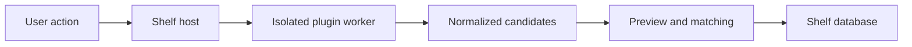

# Plugin architecture

## Product boundary

Shelf Server is the commercial host and system of record. The open plugin SDK
defines a narrow integration boundary. Plugins discover or parse data and return
candidates; only Shelf can modify a collection.

## Plugin categories

### Import plugins

Import plugins process user-selected exports, spreadsheets, databases, or cover
folders. Imports are previewed before they are committed and should be
repeatable and reversible.

### Provider plugins

Provider plugins connect to metadata, cover, and pricing services. A customer
may supply their own provider account, API key, or OAuth authorization. Using a
customer-owned account does not override the provider's license or terms.

## Intended runtime

The production host is intended to run third-party plugins in a separate worker
process. Communication will use a versioned local protocol. The host grants a
plugin only the declared capabilities and permissions.

Plugins must not receive database credentials or unrestricted access to Shelf's
internal services.

## Provenance

Every imported or retrieved item carries its provider, external identifier,
retrieval time, and optional source URL. Pricing providers should additionally
identify currency, condition, observation date, and price type when those
contracts are added.

## Compatibility

The manifest declares `shelfApiVersion`. Pre-1.0 contracts may change. Starting
with 1.0, breaking contract changes will require a new major API version, while
Shelf should continue supporting the previous major version for a documented
migration period.

## Trust levels

Shelf can distinguish:

1. Official plugins maintained by Shelf.
2. Verified plugins reviewed and signed by a known publisher.
3. Community plugins installed explicitly by the user.

Trust is not a substitute for isolation or permission checks.

